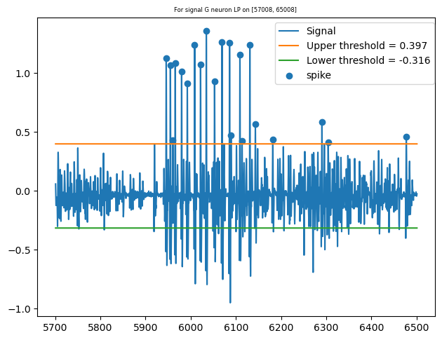
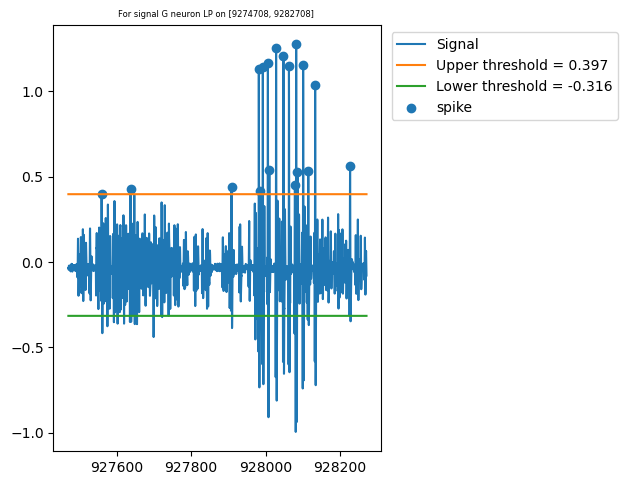

# How to use quarto   

## Images 

Two column, numbered and described figure. 

```qmd
:::{#fig-G-LP-1  layout-ncol=2}

 


El umbral superior está demasiado cerca 
:::
```  

## Labeled tables

Is important to finish with `: <Table description> {#tbl-<name>}`. 

```md
| Trozo | Neurona | Umbral inferior | Umbral superior | Número de spikes |
| :-: | :-: | :-: | :-: | :-: |
| C | LP | -0.320|  0.402 | 30308 | 
| C | VD | -0.084 | 0.205 | 21246 |   
| R | LP | -0.534 | 0.920 | 24076 |    
| R | VD | -0.085 | 0.206 | 17618 |   
| G | LP | -0.316 | 0.397 | 25889 |   
| G | VD | -0.120 | 0.207 | 13127 |       

: Selección primera de umbrales {#tbl-threshold1}
```
